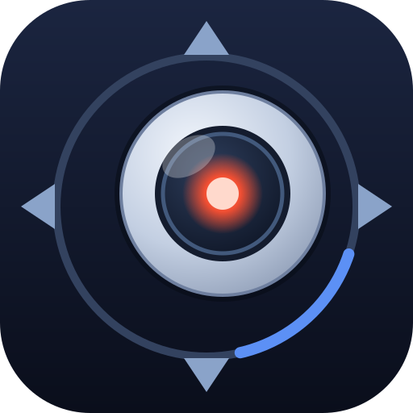
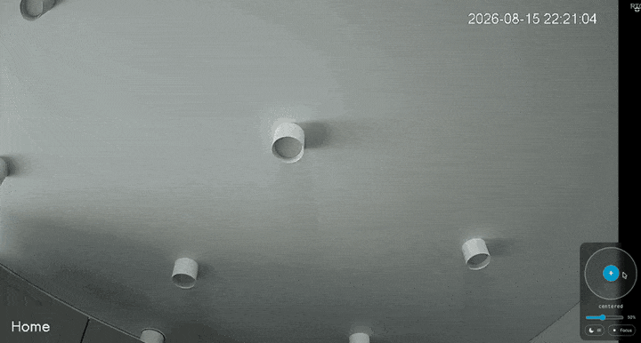
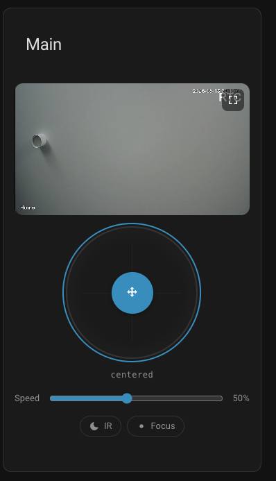
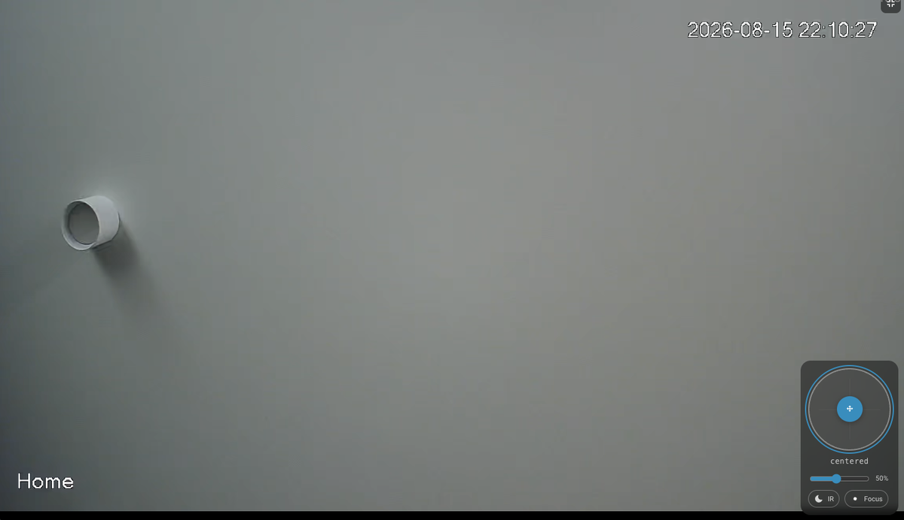

# ONVIF PTZ для Home Assistant

Наводить камеру, перетаскивая джойстик — на панели или с телефона. Плюс
сущности и сервисы, которые за этим стоят.

[![hacs][hacs-badge]][hacs-url]
[![release][release-badge]][release-url]
[![license][license-badge]](LICENSE)

[English version](README.md)

[![Открыть репозиторий в HACS][my-badge]][my-url]

<p align="center">
  
</p>

<p align="center">
  <em>Нажатие на видео разворачивает его на весь экран — джойстик уменьшается и всплывает поверх.</em>
</p>

## Зачем это рядом со штатной интеграцией ONVIF

В Home Assistant есть отличная интеграция ONVIF, и для большинства камер
правильный выбор — она: видео, события, сенсоры, PTZ. Этот проект её не
заменяет. Он закрывает две задачи за её рамками.

**Джойстика нет.** Ядро даёт сервис `onvif.ptz`, а интерфейс оставляет на
пользователя: кнопки со стрелками, собранные в YAML, по одному нажатию на
шаг. Для редких поправок нормально, для наведения — мучительно. Здесь
поверхность управления и есть суть: площадка с мёртвой зоной, регулировкой
скорости и удержанием команды, на карточке, которая разворачивается поверх
живого видео — видно, куда наводишь.

**Часть камер не доводит инициализацию ONVIF до конца.** Прошивка, которая не
может достучаться до облака производителя, нередко возвращает пустой
`VideoEncoderConfiguration` — `Encoding: None`, `Resolution: None`, — и
настройка в ядре падает с `There were no H.264 streams available`, утягивая
PTZ следом за медиа. Эта интеграция медиа-профили не трогает вовсе, поэтому
движение работает и там, где ядро камеру настроить не может. Видео добавляется
отдельно, через Generic Camera или go2rtc.

Из того же решения следуют два меньших отличия:

- **Дрейф часов компенсируется на каждом запросе.** Камеры без батарейки RTC
  уходят на минуты в неделю и начинают отвергать метки WS-Security. Метка
  ставится по часам самой камеры — ни NTP, ни ночного скрипта не нужно.
- **Карточка едет внутри интеграции.** Один репозиторий HACS, ресурс в панели
  добавлять вручную не надо.

Если ваша камера работает со штатной интеграцией — пользуйтесь штатной.

## Что внутри

| Путь | Назначение |
|---|---|
| `custom_components/onvif_ptz/` | Интеграция: устройство, сущности, сервисы |
| `custom_components/onvif_ptz/frontend/` | Карточка Lovelace, регистрируется автоматически |
| `tools/onvif-check.sh` | Диагностика камеры через curl (вывод на английском) |
| `tools/check_imaging.py` | То же на Python, с подробным выводом |
| `custom_components/onvif_ptz/brand/` | Иконка интеграции |
| `icon.svg` | Исходник иконки |

Видеопоток сюда не входит — добавьте его отдельно через **Generic Camera**
или go2rtc. Разделение намеренное: PTZ и видео ломаются по разным причинам,
и чинить их проще по отдельности.

## Компенсация дрейфа часов

ONVIF использует WS-Security с меткой времени, и камера отклоняет запросы,
если метка расходится с её часами больше чем на несколько минут. Отсюда
ошибка `Wsse authorized time check failed`.

Интеграция вызывает `GetSystemDateAndTime` (этот метод по спецификации не
требует аутентификации), вычисляет расхождение и подставляет метку **по часам
камеры**. Смещение пересчитывается раз в 10 минут.

Практический смысл: камере не нужен ни NTP, ни рабочий режим синхронизации,
ни ежедневный скрипт установки времени. Пусть её часы уходят хоть на час —
запросы всё равно будут проходить.

## Установка

### Через HACS

1. HACS → Интеграции → три точки → **Пользовательские репозитории**
2. URL репозитория, категория **Integration**
3. Найти «ONVIF PTZ», установить, перезапустить Home Assistant
4. **Настройки → Устройства и службы → Добавить интеграцию → ONVIF PTZ**

Карточка ставить отдельно не нужно: она едет внутри интеграции и
регистрируется сама. Ресурс в панели управления добавлять не надо —
это чаще всего и вызывает проблемы с кэшем.

### Вручную

Скопировать `custom_components/onvif_ptz` в `/config/custom_components/`
и перезапустить Home Assistant.

## Настройка карточки

Через интерфейс: на панели → **Добавить карточку** → «ONVIF PTZ».
Все поля есть в визуальном редакторе, YAML править не обязательно.

Минимальный вариант в YAML:

```yaml
type: custom:onvif-ptz-card
title: Двор
go2rtc_url: https://…/api/hassio_ingress/…
stream: profile000
speed: 0.6
```

| Параметр | Назначение |
|---|---|
| `go2rtc_url` | адрес go2rtc без `/stream.html` |
| `stream` | имя потока из `go2rtc.yaml` |
| `mode` | `webrtc` (по умолчанию), `mse` или `mp4` |
| `camera_entity` | запасной путь через сущность HA, если нет go2rtc |
| `live` | `false` — статичный кадр вместо потока |
| `speed` | скорость по умолчанию, 0.1–1.0 |
| `axis_lock` | `false` — разрешить диагональное движение |
| `motion_entity` | индикатор движения поверх видео |
| `night_entity`, `autofocus_entity` | чипы переключения |
| `presets` | список `{name, token}` |

## Иконка

Лежит в `custom_components/onvif_ptz/brand/` и подхватывается автоматически —
с Home Assistant 2026.3 пользовательские интеграции могут возить собственные
изображения, и локальные файлы имеют приоритет над каталогом brands. Отправлять
PR в `home-assistant/brands` не нужно.

На версиях старше 2026.3 в интерфейсе будет стандартный значок. Тогда, если
иконка важна, файлы из `brand/` подходят для PR в brands как есть:
`custom_integrations/onvif_ptz/icon.png` и `icon@2x.png`.

Исходник — `icon.svg` в корне. Пересобрать:

```sh
pip install cairosvg
python3 -c "
import cairosvg
for size, name in ((256, 'icon.png'), (512, 'icon@2x.png')):
    cairosvg.svg2png(url='icon.svg',
                     write_to=f'custom_components/onvif_ptz/brand/{name}',
                     output_width=size, output_height=size)
"
```

Кольцо с четырьмя направлениями — та же площадка джойстика, что и в карточке.
Купол камеры смещён от центра так же, как отклоняется ручка при повороте.
Единственный тёплый цвет — свечение инфракрасной подсветки в объективе.

## Изображение, ИК, движение

| Сущность | Что делает |
|---|---|
| `number` Яркость / Насыщенность / Контраст / Резкость | параметры изображения |
| `switch` «Ночной режим» | ИК-фильтр, если камера его отдаёт |
| `switch` «Автофокус» | режим фокуса AUTO / MANUAL, если поддерживается |
| `binary_sensor` «Движение» | детекция через PullPoint |

Создаётся только то, что камера подтвердила в `GetOptions`. Набор сильно
разный: многие прошивки отдают лишь четыре числовых параметра и не
поддерживают ни ИК-фильтр, ни автофокус — тогда переключателей просто не
будет. Проверить свою камеру можно скриптом `tools/onvif-check.sh`.

`SetImagingSettings` заменяет настройки целиком, а не точечно, поэтому
перед записью интеграция дочитывает текущие значения. Иначе правка
яркости обнулила бы контраст.

**Про логику ИК.** В ONVIF это `IrCutFilter`, и она обратна интуиции:
значение `ON` означает, что отсекающий фильтр опущен, то есть дневной
цветной режим. `OFF` пропускает инфракрасный свет и включает ночную съёмку.
Переключатель называется «Ночной режим» и переводит это сам: включён —
`IrCutFilter: OFF`. Исходное значение видно в атрибуте `ir_cut_filter`.

**Про движение.** Используется PullPoint-подписка: запрос висит до 30 секунд
и возвращается либо с событием, либо пустым. Это дешевле частого опроса и
даёт задержку в доли секунды. Подписка пересоздаётся при обрыве — дешёвые
прошивки теряют её при малейшей заминке в сети.

Часть камер шлёт только начало события, без пары «движение закончилось».
Поэтому сенсор гаснет сам через 30 секунд тишины.

Чтобы показать всё это в карточке, укажите сущности:

```yaml
type: custom:onvif-ptz-card
go2rtc_url: https://…/api/hassio_ingress/…
stream: profile000
night_entity: switch.ptz_camera_nochnoy_rezhim
autofocus_entity: switch.ptz_camera_avtofokus
motion_entity: binary_sensor.ptz_camera_dvizhenie
```

Чипы ИК и фокуса доступны в обоих режимах, включая развёрнутый. Индикатор
движения появляется поверх видео.

## Что появляется в Overview автоматически

Интеграция создаёт пять кнопок — влево, вправо, вверх, вниз, стоп. Они
попадают в автогенерируемый Overview сами, сгруппированные под устройством,
без правки YAML и без «взятия панели под управление».

Джойстик так добавить нельзя: Overview строится стратегией `original-states`,
которая знает только про сущности и штатные типы карточек. Кастомные карточки
доступны только на панели, взятой под управление.

## Раскладка

Карточка подстраивается под ширину **своего контейнера**, а не окна — это
важно, когда она стоит в узкой колонке на широком мониторе. Используются
контейнерные запросы:

| Ширина карточки | Раскладка |
|---|---|
| до 320 px | компактные отступы и подписи |
| 320–620 px | видео сверху, джойстик под ним |
| от 620 px | видео и управление рядом |

Джойстик масштабируется вместе с карточкой (`clamp(150px, 55cqw, 210px)`),
ручка пересчитывается через `ResizeObserver`.



Автоматику можно переопределить двумя параметрами:

```yaml
layout: side     # auto (по умолчанию) | stack | side
align: right     # left | center | right
```

- `auto` — переключается по ширине, как в таблице выше
- `stack` — джойстик всегда под видео
- `side` — всегда рядом, независимо от ширины

`align` задаёт положение джойстика в раскладке столбиком. В раскладке «рядом»
он же решает, с какой стороны панель управления: `left` переносит её влево от
видео, `right` и `center` оставляют справа.

## Развёрнутый режим



Нажатие на видео разворачивает его на весь экран, джойстик становится
компактным и всплывает поверх: на широком экране — справа по центру, на
узком — снизу. Свернуть можно кнопкой в углу или клавишей **Escape**.

Нажатие ловится прозрачным слоем поверх плеера: iframe перехватывает
указатель и сам события наружу не отдаёт.

При развёртывании видео **не перезагружается** — меняются только CSS-классы,
узел плеера остаётся на месте в дереве. Перенос iframe в другого родителя
вызвал бы переподключение потока.

## Управление

- **Мышь или палец** — тяните ручку из центра, отпустите для остановки.
- **Клавиатура** — сфокусируйтесь на джойстике (Tab) и удерживайте стрелки.
- **Скорость** — ползунок снизу, множитель для вектора движения.

Внутри есть мёртвая зона (12% радиуса) и порог по изменению вектора, чтобы не
заваливать камеру командами при каждом движении мыши. Пока ручка отклонена,
команда повторяется раз в 2 секунды — иначе камера остановится сама по своему
`DefaultPTZTimeout`.

## Сервисы

| Сервис | Описание |
|---|---|
| `onvif_ptz.move` | Двигаться со скоростью `pan` / `tilt` / `zoom` (−1…1) |
| `onvif_ptz.stop` | Остановиться |
| `onvif_ptz.step` | Дёрнуться на `duration` секунд и встать |
| `onvif_ptz.goto_preset` | Перейти к сохранённой позиции |
| `onvif_ptz.set_preset` | Запомнить текущее положение |

Пример кнопки на панели без джойстика:

```yaml
type: button
name: Влево
tap_action:
  action: call-service
  service: onvif_ptz.step
  data:
    pan: -0.6
    duration: 0.5
```

## Языки

Английский и русский. Названия сущностей и сервисов берутся из
`custom_components/onvif_ptz/translations/`, карточка определяет язык по
`hass.language`, а до его появления — по локали браузера. Остальные языки
получают английский вариант.

Добавить язык: скопировать `translations/en.json` в `translations/<код>.json`
и дописать соответствующий блок в `STRINGS` внутри
`custom_components/onvif_ptz/frontend/onvif-ptz-card.js`.

## Если не подключается

**`cannot_connect`** — проверьте порт: у Dahua и клонов ONVIF нередко висит на
`8000`, а не на `80`. Проверить можно так:

```sh
curl -s -m 5 -X POST http://КАМЕРА/onvif/device_service \
  -H 'Content-Type: application/soap+xml' \
  -d '<s:Envelope xmlns:s="http://www.w3.org/2003/05/soap-envelope"><s:Body><GetSystemDateAndTime xmlns="http://www.onvif.org/ver10/device/wsdl"/></s:Body></s:Envelope>'
```

Ответ с `UTCDateTime` означает, что порт верный.

**`invalid_auth`** — учётные данные не подошли. Обратите внимание, что у части
камер логин для ONVIF отдельный от веб-интерфейса и создаётся в настройках
пользователей.

**Камера в изолированной зоне firewall** — нужен forward для TCP/80 (или того
порта, где ONVIF) от хоста Home Assistant. Если камера отвечает только соседям
по подсети, добавьте на роутере SNAT: подменяйте адрес источника на адрес
роутера в этой подсети.

## Диагностика

```sh
sh tools/onvif-check.sh 192.168.2.2 80 admin ПАРОЛЬ
```

Нужны только `curl` и `openssl`. Метка WSSE считается по часам камеры,
поэтому дрейф проверке не мешает. Скрипт показывает, какие сервисы отвечают,
что разрешает `GetOptions` и приходят ли события движения.

## Ограничения

- Только pan-tilt-zoom. Событий движения и видео здесь нет.
- Абсолютное позиционирование не реализовано — только непрерывное движение и
  переходы к сохранённым позициям.
- Карточка не имеет визуального редактора, настраивается через YAML.

[hacs-badge]: https://img.shields.io/badge/HACS-custom-41BDF5.svg
[hacs-url]: https://github.com/hacs/integration
[release-badge]: https://img.shields.io/github/v/release/leequixxx/onvif-ptz
[release-url]: https://github.com/leequixxx/onvif-ptz/releases
[license-badge]: https://img.shields.io/github/license/leequixxx/onvif-ptz
[my-badge]: https://my.home-assistant.io/badges/hacs_repository.svg
[my-url]: https://my.home-assistant.io/redirect/hacs_repository/?owner=leequixxx&repository=onvif-ptz&category=integration
